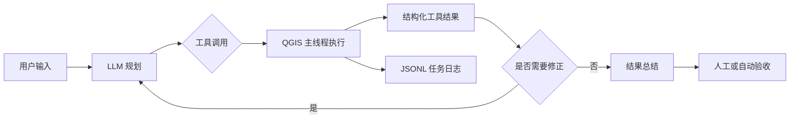

# QGIS Agent

<p align="center">
  
</p>

<p align="center">
  面向 QGIS Desktop 的自然语言地理分析插件
</p>

**QGIS Agent** 将大语言模型的 Tool Calling 与 QGIS/PyQGIS 工具连接起来。用户可以在 QGIS 停靠面板中用中文描述任务，由 Agent 读取当前工程、规划工具调用、执行空间处理，并把结果图层、输出文件和执行日志返回到当前 QGIS 会话。

> 当前插件版本：`1.1.0`

> 当前状态：早期可用版本。请优先在测试工程和数据副本中使用，不要把模型回复直接视为已经通过 GIS 业务验收的最终结论。

## 目录

- [项目定位](#项目定位)
- [一次任务如何执行](#一次任务如何执行)
- [功能与工具](#功能与工具)
- [安全与隔离](#安全与隔离)
- [环境要求](#环境要求)
- [安装插件](#安装插件)
- [配置 LLM](#配置-llm)
- [使用示例](#使用示例)
- [日志与结果验收](#日志与结果验收)
- [测试基线](#测试基线)
- [常见失败与恢复](#常见失败与恢复)
- [已知边界](#已知边界)
- [项目结构](#项目结构)
- [开发与验证](#开发与验证)

## 项目定位

这是一个 **QGIS Python 插件**，不是独立桌面应用，也不是远程 GIS 服务。

插件负责：

- 提供 QGIS Dock 对话面板；
- 把当前工程图层和内置空间工具提供给 LLM；
- 执行经过权限检查的 QGIS/PyQGIS 操作；
- 将处理结果加载回当前 QGIS 工程；
- 记录可复查的本地 JSONL 任务日志。

插件不负责：

- 自动证明模型选择的 GIS 分析方法一定正确；
- 自动选择适用于所有地区的投影坐标系；
- 为自定义 Python 提供操作系统级沙箱；
- 替代人工检查几何、坐标系、字段和业务指标。

## 一次任务如何执行



线程边界如下：

- LLM 网络请求和推理循环运行在后台线程，避免阻塞 QGIS 界面；
- QGIS API、Processing 和确认对话框通过信号切回 QGIS 主线程；
- 工作线程等待主线程工具执行时受 `tool_execution_timeout` 限制；
- 已经进入 QGIS 主线程并开始运行的 Processing 任务不能由普通 Python 线程强制终止。

### 完整示例：经纬度图层的 500 米缓冲

用户输入：

```text
将 areas 图层按 500 米缓冲，保存为 areas_buffer.gpkg。
```

预期过程：

1. Agent 调用 `get_layer_info`，读取图层类型和 CRS；
2. 如果 `areas` 使用 `EPSG:4326`，首次 `buffer` 返回：

   ```json
   {
     "success": false,
     "data": {
       "error_code": "GEOGRAPHIC_CRS_DISTANCE",
       "crs": "EPSG:4326",
       "suggested_action": "reproject"
     }
   }
   ```

3. Agent 不把 500 度误当作 500 米，而是调用 `reproject`；
4. 用户或 Agent 需要根据数据所在地区选择适合的投影 CRS；
5. Agent 对重投影后的图层重新调用 `buffer`；
6. 插件检查工具返回值并把输出加载到当前工程；
7. 最终回复应说明输出位置、输出 CRS、执行限制和需要人工检查的内容。

这个案例的固定测试描述位于 [`tests/data/task_cases.json`](tests/data/task_cases.json)，更完整的评估说明位于 [`docs/evaluation.md`](docs/evaluation.md)。

## 功能与工具

### Agent 能力

- 中文自然语言交互；
- 多轮 Tool Calling；
- 当前 QGIS 工程图层感知；
- 工具失败后的参数修正与后续重试；
- 可选对话记忆及历史长度限制；
- 工具调用、工具结果和任务日志可视化；
- OpenAI 兼容接口、Anthropic 和 Ollama 后端。

### 17 个内置工具

| 分类 | 工具 | 作用 |
| --- | --- | --- |
| 数据加载 | `load_vector` | 加载 Shapefile、GeoJSON、GeoPackage 等矢量数据 |
| 数据加载 | `load_raster` | 加载 GeoTIFF、IMG 等栅格数据 |
| 数据加载 | `load_wms` | 加载指定服务 URL 和图层名的 WMS 图层 |
| 工程读取 | `list_layers` | 列出当前 QGIS 工程中的图层和图层 ID |
| 工程读取 | `get_layer_info` | 读取图层 CRS、范围、字段、几何类型和要素数 |
| 空间分析 | `buffer` | 创建矢量缓冲区 |
| 空间分析 | `clip` | 使用面图层裁剪输入图层 |
| 空间分析 | `intersect` | 计算两个矢量图层的交集 |
| 空间分析 | `dissolve` | 融合全部要素或按字段分组融合 |
| 空间分析 | `calculate_area` | 计算面图层面积统计 |
| 空间分析 | `reproject` | 将矢量图层重投影到目标 CRS |
| 空间分析 | `spatial_join` | 按空间关系连接图层属性 |
| 结果输出 | `export_layer` | 导出 GPKG、Shapefile 或 GeoJSON |
| 结果输出 | `export_map_image` | 导出当前地图画布图片 |
| 结果输出 | `generate_report` | 生成经过 HTML 转义的属性报告 |
| 高风险 | `execute_python` | 执行自定义 PyQGIS/Python 代码 |
| 高风险 | `run_processing_algorithm` | 调用白名单内的 QGIS Processing 算法 |

`execute_python` 和 `run_processing_algorithm` 安装后默认关闭，不会默认暴露给模型。

## 安全与隔离

### 默认策略

| 风险点 | 默认行为 | 可配置项 |
| --- | --- | --- |
| 自定义 Python | 关闭，不向模型暴露 | `enable_python_tool` |
| Python 自动执行 | 关闭，每次在 QGIS 主界面确认 | `enable_auto_execute` |
| 通用 Processing | 关闭，不向模型暴露 | `enable_generic_processing` |
| Processing 算法范围 | 仅允许白名单算法 | `allowed_processing_algorithms` |
| 输出目录 | 仅允许写入配置的输出根目录 | `restrict_output_paths` |
| 覆盖已有文件 | 默认拒绝 | `allow_overwrite` |
| 本地任务日志 | 默认开启 | `enable_task_logging` |

高风险工具有多层检查：

1. 未启用时不加入发送给 LLM 的 Tool Schema；
2. 即使模型伪造工具调用，Agent 层仍会拒绝；
3. 工具实现再次检查运行时配置；
4. `execute_python` 默认还需要用户在 QGIS 主窗口逐次确认。

### 输出路径隔离

普通输出工具会：

- 将相对路径解析到配置的 `output_dir`；
- 使用规范化真实路径检查目录逃逸；
- 默认拒绝输出到根目录以外；
- 默认拒绝覆盖已有文件；
- 在需要时创建输出文件的父目录。

默认输出目录：

```text
~/qgis_agent_output
```

> 路径隔离不能约束已经由用户授权执行的任意 Python 代码。`execute_python` 使用当前 QGIS 进程和当前操作系统用户权限运行，不是沙箱。

### 图层和空间语义检查

- 重名图层不会静默选择第一个匹配项，而是要求使用唯一图层 ID；
- 地理坐标系图层不会直接按“米”执行缓冲；
- 裁剪图层必须是面图层；
- 常用空间分析会检查矢量类型和几何类型；
- 常用空间处理结果会尝试作为 QGIS 图层重新加载；是否满足业务要求仍需继续验收。

## 环境要求

- QGIS `3.16` 至 `3.x`；
- QGIS 自带 Python 3 和 PyQt 环境；
- 可访问所配置的 LLM 服务，或本机运行 Ollama；
- 使用自动工具调用时，模型和服务端需要支持 Tool Calling / Function Calling。

插件自身只使用 Python 标准库以及 QGIS/PyQt 自带模块，不要求在 QGIS Python 中额外安装第三方包。

当前自动化集成基线使用：

```text
QGIS 3.44.11
```

这不表示其他 QGIS 3.x 版本一定存在问题，但发布前仍应在目标版本中人工验证。

## 安装插件

### 方法一：从 ZIP 安装

ZIP 内必须以 `qgis_agent` 作为插件根目录：

```text
qgis_agent.zip
└── qgis_agent/
    ├── metadata.txt
    ├── __init__.py
    ├── plugin.py
    └── ...
```

在仓库根目录执行：

```powershell
Compress-Archive -Path .\qgis_agent -DestinationPath .\qgis_agent.zip -Force
```

然后：

1. 打开 QGIS；
2. 进入 **插件 → 管理并安装插件 → 从 ZIP 安装**；
3. 选择 `qgis_agent.zip`；
4. 安装后在“已安装”页面启用 **QGIS Agent**；
5. 点击工具栏中的 QGIS Agent 按钮打开右侧 Dock 面板。

### 方法二：复制目录

将整个 `qgis_agent` 文件夹复制到当前 QGIS Profile 的插件目录。

常见位置：

- Windows：`%APPDATA%\QGIS\QGIS3\profiles\default\python\plugins\`
- macOS：`~/Library/Application Support/QGIS/QGIS3/profiles/default/python/plugins/`
- Linux：`~/.local/share/QGIS/QGIS3/profiles/default/python/plugins/`

复制完成后重启 QGIS，并在插件管理器中启用插件。

## 配置 LLM

打开 QGIS Agent 面板，点击 **设置**。

### Provider

| Provider | 接口路径 | API Key |
| --- | --- | --- |
| `openai_compatible` | `<API Base>/chat/completions` | 必需 |
| `anthropic` | `<API Base>/messages` | 必需 |
| `ollama` | `<API Base>/api/chat` | 默认不需要 |

### OpenAI 兼容接口

```text
Provider: openai_compatible
API Base URL: https://你的服务地址/v1
API Key: 你的密钥
Model: 服务端支持 Tool Calling 的模型名
```

插件配置中的默认值是：

```text
API Base URL: https://api.openai.com/v1
Model: gpt-4o
```

默认值只是代码初始配置，不代表对当前模型版本或服务可用性的动态推荐。

### Anthropic

```text
Provider: anthropic
API Base URL: https://api.anthropic.com/v1
API Key: 你的密钥
Model: 你的 Anthropic 模型名
```

### Ollama

```text
Provider: ollama
API Base URL: http://localhost:11434
API Key: 留空
Model: 本地已安装并支持当前任务的模型名
```

是否能够可靠调用空间工具取决于模型及服务端是否正确实现 Tool Calling。

### 主要设置

| 设置 | 默认值 | 说明 |
| --- | ---: | --- |
| Temperature | `0.1` | 模型输出随机性 |
| Max Tokens | `4096` | 单次模型回复上限 |
| 请求超时 | `120` 秒 | 单次 LLM HTTP 请求最长等待时间 |
| 失败重试次数 | `2` | 额外重试次数，范围 0–5 |
| 最大推理轮次 | `10` | 单任务 LLM→工具循环上限 |
| 工具等待超时 | `300` 秒 | 后台线程等待 QGIS 主线程的时间 |
| 保留对话历史 | 开启 | 是否保留多轮对话 |
| 最大历史条数 | `20` | 对话历史长度上限 |
| 路径隔离 | 开启 | 限制普通输出到输出根目录 |
| 允许覆盖 | 关闭 | 是否覆盖已有输出 |
| 任务日志 | 开启 | 是否写入 JSONL 任务日志 |

配置文件位置：

```text
~/.qgis_agent/config.json
```

也可以通过环境变量覆盖：

```text
QGIS_AGENT_CONFIG_PATH
```

配置文件包含 API Key。请限制文件访问权限，不要提交到版本控制，也不要直接对外分享。

## 使用示例

### 检查当前工程

```text
列出当前工程中的全部图层，并指出哪些是面图层。
```

### 加载并分析数据

```text
加载 D:\data\roads.gpkg，先检查坐标系，再对 roads 做 500 米缓冲，保存为 roads_buffer.gpkg。
```

推荐使用相对输出路径。相对路径会被解析到配置的输出目录。

### 计算面积

```text
计算 districts 图层的面积统计，并说明使用的坐标系和单位。
```

### 空间裁剪

```text
使用 boundary 面图层裁剪 parcels，将结果保存为 parcels_clip.gpkg。
```

### 生成报告

```text
为 districts 图层生成属性报告，保存为 districts_report.html，最多展示 500 条记录。
```

### 导出地图

```text
将当前地图画布导出为 map.png，尺寸 2560×1440，DPI 为 150。
```

### 加载 WMS

```text
加载 WMS 服务 https://example.com/wms，服务图层名为 workspace:layer，显示名称设为“在线底图”。
```

## 日志与结果验收

启用任务日志后，每个非空且配置有效的用户任务会创建一个 JSONL 文件：

```text
<output_dir>/logs/task_<timestamp>_<run_id>.jsonl
```

插件面板的“日志”页会在任务结束后显示本次日志文件路径。

主要事件：

```text
task_started
llm_request
llm_response
tool_call
tool_result
task_finished
```

日志包括：

- `run_id` 和时间戳；
- 用户输入；
- Provider 和模型名；
- LLM 请求轮次；
- 工具名称、参数和结果；
- 成功与失败工具计数；
- 任务结束状态和基础 `accepted` 标志。

常见密钥字段会被脱敏，但日志仍可能包含用户输入、本地路径、图层名称、字段名称和工具参数。提交 Issue 前请先检查并清理敏感内容。

### `accepted` 的含义

当前 `accepted=true` 只表示：

- Agent 以 `success` 状态结束；
- 本次任务日志没有记录到失败工具。

它不自动验证：

- 输出几何是否符合业务预期；
- CRS 是否适合研究区域；
- 几何是否全部有效；
- 字段值和统计指标是否正确；
- 地图制图表达是否合格。

当前实现采用保守规则：即使 Agent 在一次失败后成功重试，只要日志记录过失败工具，基础 `accepted` 仍可能为 `false`。请结合最终输出和工具链进行人工验收。

## 测试基线

截至 **2026-07-22**，仓库中的可重复验证结果为：

| 层级 | 结果 | 覆盖范围 |
| --- | --- | --- |
| 普通 Python 单元测试 | `23/23` 通过 | 配置、协议转换、HTTP 重试、Agent 循环、权限、路径、日志、评测数据和插件包结构 |
| QGIS 3.44.11 集成探针 | `5/5` 通过 | 图层读取、面积计算、地理 CRS 缓冲拒绝、工具/Schema 一致性、插件入口加载 |
| 真实 LLM 端到端任务 | 尚无稳定样本量 | 需要按模型、服务端、数据集和 QGIS 版本分别统计 |

这里的 100% 仅表示已经编写的确定性检查全部通过，**不表示真实自然语言任务成功率为 100%**。

异常测试集当前包含：

1. 地理 CRS 缓冲后的重投影恢复；
2. 重名图层；
3. 输出路径逃逸；
4. 已有输出覆盖；
5. Processing 算法不在白名单；
6. Python 执行未授权；
7. LLM `429 → 503 → 200` 传输层重试。

详细测试范围见 [`docs/evaluation.md`](docs/evaluation.md)。

## 常见失败与恢复

| 失败 | 插件行为 | 建议恢复方式 |
| --- | --- | --- |
| 图层名称重复 | 拒绝静默选择 | 调用 `list_layers`，改用唯一图层 ID |
| 经纬度图层按米缓冲 | 返回 `GEOGRAPHIC_CRS_DISTANCE` | 先选择合适的投影 CRS 并重投影 |
| 输出超出允许目录 | 拒绝路径 | 使用相对路径或输出根目录内的绝对路径 |
| 输出文件已存在 | 默认拒绝覆盖 | 更换文件名，或明确启用覆盖策略 |
| Processing 算法不在白名单 | 返回 `PROCESSING_ALGORITHM_NOT_ALLOWED` | 使用内置工具或修改白名单后重试 |
| Python 未启用或未确认 | 拒绝执行 | 在理解风险后显式启用并逐次确认 |
| HTTP 429、500、502、503、504 | 指数退避重试 | 检查服务状态、限流和重试配置 |
| HTTP 400、401、403、404 | 不做无意义重试 | 修正 URL、API Key、模型名或请求参数 |
| LLM 返回无效 JSON | 任务失败并记录错误 | 更换兼容服务或支持工具调用的模型 |
| 达到最大推理轮次 | 返回 `iteration_limit` | 缩小任务范围，拆分为多个步骤 |
| 主线程工具等待超时 | 取消尚未执行的请求 | 检查 QGIS 是否繁忙，适当增加超时 |

## 已知边界

1. **LLM 会犯错。** 模型可能选错图层、字段、算法、参数或投影坐标系。
2. **自定义 Python 不是沙箱。** 经用户授权后，它拥有当前 QGIS 用户的文件和进程权限。
3. **Processing 无法被安全强制终止。** 已经开始执行的长任务可能继续占用 QGIS。
4. **基础验收不是 GIS 语义验收。** 当前没有通用机制自动证明几何和业务指标正确。
5. **真实 LLM 成功率尚未形成基准。** 单元测试与固定探针不能代表不同模型的实际表现。
6. **GUI 生命周期尚未全自动化。** 当前探针验证插件入口，但没有自动覆盖 ZIP 安装、启用、打开 Dock 和卸载全过程。
7. **WMS 和第三方服务受外部环境影响。** 网络、服务版本、鉴权和图层配置都可能导致失败。
8. **不同 QGIS 版本可能存在差异。** Processing 参数、驱动和 PyQt 行为需要在目标版本验证。

## 项目结构

```text
QGIS_Agent_Plugins/
├── qgis_agent/                    # 可安装的 QGIS 插件目录
│   ├── __init__.py                # classFactory 插件入口
│   ├── metadata.txt               # QGIS 插件元数据
│   ├── plugin.py                  # 插件生命周期
│   ├── icon.svg
│   ├── core/
│   │   ├── agent.py               # 多轮 Tool Calling 循环
│   │   ├── config.py              # 配置加载、校验和原子保存
│   │   ├── llm_client.py          # 三类 LLM 后端和 HTTP 重试
│   │   └── run_logger.py          # JSONL 任务日志
│   ├── tools/
│   │   └── spatial_tools.py       # 17 个内置 QGIS 工具
│   └── ui/
│       ├── main_panel.py          # Dock 面板和线程边界
│       └── settings_dialog.py     # 插件设置窗口
├── docs/
│   └── evaluation.md              # 测试、完整任务与验收边界
├── tests/
│   ├── data/task_cases.json       # 固定任务和异常案例
│   ├── test_core.py               # 普通 Python 单元测试
│   ├── qgis_integration_probe.py  # QGIS 运行时探针
│   └── run_qgis_probe.py          # Windows QGIS 环境包装器
├── LICENSE
└── README.md
```

## 开发与验证

### 普通 Python 检查

不依赖 QGIS 运行时的测试可以直接执行：

```powershell
python -m unittest discover -s tests -v
python -m compileall -q qgis_agent tests
git diff --check
```

### QGIS 集成探针

Windows 示例：

```powershell
python tests/run_qgis_probe.py --qgis-root D:\QGIS3.44.11
```

包装器会构造独立的 QGIS/Python/Qt 环境和临时 QGIS Profile，避免污染真实项目与用户配置。

当前探针检查：

```text
list_layers
calculate_area
geographic_buffer_rejected
tool_registry_matches_schema
plugin_entrypoint_loads
```

### 注册自定义工具

```python
agent.register_tool(
    "describe_project",
    lambda: {
        "success": True,
        "data": {"name": "demo"},
        "message": "工程信息读取完成",
    },
    schema={
        "type": "function",
        "function": {
            "name": "describe_project",
            "description": "返回当前工程摘要",
            "parameters": {
                "type": "object",
                "properties": {},
                "required": [],
            },
        },
    },
)
```

自定义工具只注册到当前 Agent 实例。调用 QGIS API 的自定义工具仍必须遵守 QGIS 主线程约束，并自行实现参数校验、权限控制、输出隔离和结果验收。

## 发布前人工检查

建议每次发布前至少完成：

- 从 ZIP 安装插件；
- 启用和禁用插件；
- 打开、隐藏和重新打开 Dock 面板；
- 保存并重新加载配置；
- 分别验证一个成功任务和一个失败任务；
- 检查 JSONL 日志与敏感信息；
- 检查输出覆盖和目录逃逸策略；
- 在目标 QGIS 版本中执行一次 Processing；
- 卸载插件并确认工具栏和 Dock 正常移除。

## 许可证

本项目采用 [Apache License 2.0](LICENSE)。

## 反馈

提交问题时建议提供：

- QGIS 精确版本；
- 操作系统；
- Provider 和模型名；
- 已脱敏的任务日志；
- 输入图层类型、CRS 和几何类型；
- 预期结果与实际结果；
- 可公开的最小复现数据。

Issue Tracker：<https://github.com/Moxiao01/QGIS_Agent_Plugins/issues>
